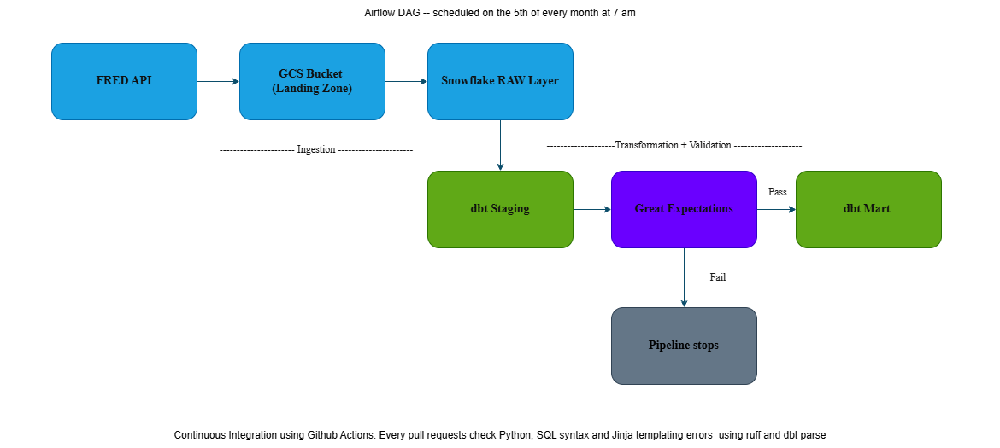

# FRED Economic Indicators Pipeline

A simple batch data pipeline that ingests 60 macroeconomic series from the Federal Reserve Economic Data (FRED) API, loads them into Snowflake, transforms them with dbt, and validates data quality with Great Expectations, and fully orchestrated by Apache Airflow.

---

## Architecture



---

## Tech Stack

| Layer | Tool | Purpose |
|---|---|---|
| Extraction | Python, FRED API | Fetch 60 economic series |
| Storage | Google Cloud Storage | Landing zone in Parquet format |
| Warehouse | Snowflake | Raw and transformed data |
| Transformation | dbt | Staging view + mart model |
| Data Quality | Great Expectations | Validation checks on staging |
| Orchestration | Apache Airflow (Astro CLI) | Scheduled DAG, runs 5th of every month at 7 am |
| CI | GitHub Actions | Ruff lint + dbt parse on every PR |

---

## Pipeline

The DAG runs automatically on the 5th of every month at 7am.

### 1. Extract and Load

Fetches all 60 series from the FRED API and writes a single Parquet file to GCS. Snowflake then reads from that file via a COPY INTO statement into the raw table. The pipeline also tracks discontinued series, that is, if a series is removed from the indicators mapping file, its rows are deleted from the raw table before the next load.

### 2. dbt Staging

Builds a view on top of the raw table with cleaned column names, correct data types, and a frequency column derived from the series metadata.

### 3. Great Expectations Validation

Runs 5 checks against the staging table before the mart is built:

- Row count > 0
- Required columns present
- No nulls on `observation_date` and `series_id`
- `frequency` values are acceptable

If any check fails the pipeline branches to a `validation_failed` task and the mart is never built. Bad data never reaches the analytical layer.

### 4. dbt Mart

The mart model calculates `period_on_period_change` for each observation. The mart table contains all columns from staging plus period_on_period_change.

---

## Data

- **60 series** from various economic categories such as GDP, Labour Market, Prices & Inflation, Financial Conditions, Housing, Consumer Expenditure, Fiscal etc.
- **156,348 rows** in the mart covering observations from **January 1975 to October 2036** (includes CBO forward projections)
- List of indicators is managed via `mapping/indicators.csv`. Adding a new indicator requires one CSV row, no Python script changes. Removing an indicators automatically removes that indicator from the warehouse so there is no stale economic data..

---

## Running Locally

### Prerequisites

Before running this project you will need:

- Python 3.12+
- Docker Desktop
- [Astro CLI](https://docs.astronomer.io/astro/cli/install-cli) — for running Airflow locally
- A [Snowflake](https://www.snowflake.com) account with a database, warehouse, and role set up
- A [GCP](https://cloud.google.com) service account with GCS read/write access, and a GCS bucket created
- A [FRED API key](https://fred.stlouisfed.org/docs/api/api_key.html) — free to obtain

### Setup

Clone the repo:

```bash
git clone https://github.com/DataChaser/data_engineering_portfolio
cd fred-data-pipeline
```

Copy the sample environment file and fill in your credentials:

```bash
# on Mac/Linux
cp .env.sample .env
# on Windows
copy .env.sample .env
```

Open `.env` and fill in:

```
SNOWFLAKE_ACCOUNT=
SNOWFLAKE_USER=
SNOWFLAKE_PASSWORD=
SNOWFLAKE_ROLE=
SNOWFLAKE_WAREHOUSE=
SNOWFLAKE_SCHEMA=
GCS_BUCKET_NAME=
GCP_CREDENTIALS_PATH=
FRED_API_KEY=
```

### Run the pipeline in Airflow

```bash
astro dev start
```

Open `http://localhost:8080`, trigger the `fred_pipeline` DAG manually. This will run the full pipeline from extracting the data to the building and testing of the mart model. If any part of the pipeline fails or the data validation checks fail, then the pipeline stops.

### To run the ingestion script directly

```bash
python src/load.py
```

### To run the validation directly

```bash
python src/validate.py
```

---

## CI

Every pull request to `main` runs two checks automatically:

- **Ruff lint**: Checks the scripts `src/` and `dags/` folders for syntax errors, unused imports, undefined variables, and f-string errors
- **dbt parse**:  Validates all SQL models and Jinja templating without connecting to Snowflake

---

## Key Design Decisions

- **GCS as a landing zone**: This is not strictly necessary at this scale. However, this pattern protects against partial loads, meaning that the raw file is written first to a temp path and renamed only after a successful write, so Snowflake never reads a partially written file.

- **Indicators managed via csv mapping file**: Any person or team in charge of data coverage can add or remove a series from `mapping/indicators.csv` file. No code changes needed.

- **Validation gates the mart**:  Great Expectations runs between staging and mart. If validation fails, the pipeline stops and the mart is never built. Bad data is caught before it reaches the analytical layer. Besides, an additional layer of dbt tests is implemented at the staging and mart layer.