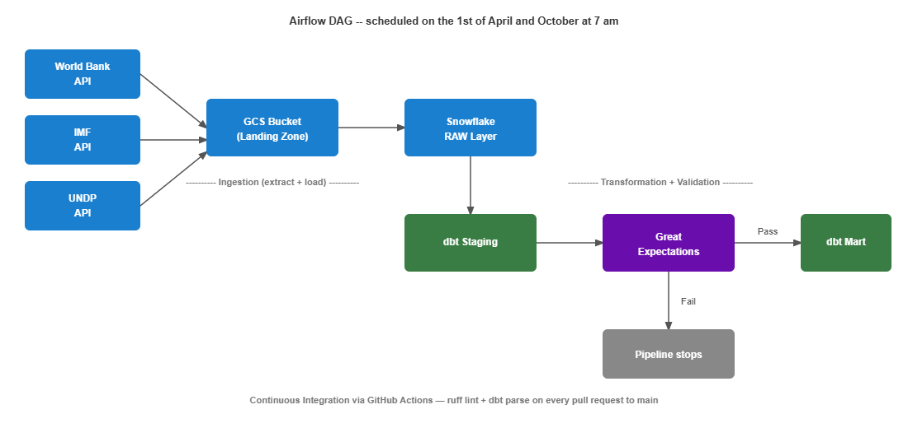

# Global Economic Pipeline

A batch data pipeline that ingests 18 economic and human development indicators from three public APIs (World Bank, IMF, and UNDP), loads them into Snowflake, transforms them with dbt, validates data quality with Great Expectations, and is fully orchestrated by Apache Airflow.

---

## Architecture



---

## Tech Stack

| Layer | Tool | Purpose |
|---|---|---|
| Extraction | Python, World Bank API, IMF DataMapper API, UNDP HDR API | Fetch 18 indicators across 30 countries from 3 sources |
| Storage | Google Cloud Storage | Landing zone for raw JSON files |
| Warehouse | Snowflake | Raw and transformed data |
| Transformation | dbt | Staging views + intermediate union + mart model |
| Data Quality | Great Expectations | Validation checks on staging |
| Orchestration | Apache Airflow (Astro CLI) | Scheduled DAG, runs 1st April and 1st October at 7am |
| CI | GitHub Actions | Ruff lint + dbt parse on every PR |

---

## Pipeline

The DAG runs automatically on the 1st of April and 1st October at 7am, aligned with the IMF World Economic Outlook release schedule.

### 1. Extract and Load

Three extract scripts run in parallel, one per source. Each fetches its indicators and writes raw JSON files to GCS. Once all three extracts complete, a single load script truncates the RAW tables and runs COPY INTO from GCS into Snowflake, one table per source.

### 2. dbt Staging

Builds three views on top of the RAW tables, one per source. Each staging model parses the VARIANT column into typed columns: country code, observation year, indicator code, and indicator value. dbt tests run after staging to validate the output.

### 3. Great Expectations Validation

Runs 2 checks against each of the three staging tables before the mart is built:

- Row count > 0
- Required columns present

If any check fails the pipeline branches to a `validation_failed` task and the mart is never built. Bad data never reaches the analytical layer.

### 4. dbt Mart

An intermediate model unions all three staging models into one long-format dataset. The mart model joins to the countries and indicators seed files to add country names, blocs, and indicator names. One row per country per indicator per year.

---

## Data

- **18 indicators** across macro fundamentals (World Bank), fiscal and monetary conditions (IMF), and human development (UNDP)
- **30 countries** spanning G7, BRICS, ASEAN, Mercosur, USMCA, and CPTPP
- Indicators and countries are managed via `mapping/indicators.csv` and `mapping/countries.csv`. Adding a new indicator or country requires one CSV row, no code changes needed.
- IMF data includes both historical actuals and forward projections. Both are retained — the source data distinguishes them and downstream users can filter as needed.

---

## Running Locally

### Prerequisites

Before running this project you will need:

- Python 3.12+
- Docker Desktop
- [Astro CLI](https://docs.astronomer.io/astro/cli/install-cli) for running Airflow locally
- A [Snowflake](https://www.snowflake.com) account with a database, warehouse, and role set up
- A [GCP](https://cloud.google.com) service account with GCS read/write access, and a GCS bucket created
- A [UNDP API key](https://hdrdata.org)

### Setup

Clone the repo:

```bash
git clone https://github.com/DataChaser/data_engineering_portfolio
cd global-economic-pipeline
```

Copy the sample environment file and fill in your credentials:

```bash
# on Mac/Linux
cp .env.example .env
# on Windows
copy .env.example .env
```

Open `.env` and fill in:

```
SNOWFLAKE_ACCOUNT=
SNOWFLAKE_USER=
SNOWFLAKE_PASSWORD=
SNOWFLAKE_ROLE=
SNOWFLAKE_WAREHOUSE=
SNOWFLAKE_DATABASE=
SNOWFLAKE_SCHEMA=
GCS_BUCKET=
GCP_CREDENTIALS_PATH=
UNDP_API_KEY=
```

### Run the pipeline in Airflow

```bash
astro dev start
```

Open `http://localhost:8080`, trigger the `global_economic_pipeline` DAG manually. This will run the full pipeline from extracting the data to the building and testing of the mart model. If any part of the pipeline fails or the data validation checks fail, then the pipeline stops.

### To run the extract and load scripts directly

```bash
python src/worldbank_extract.py
python src/imf_extract.py
python src/undp_extract.py
python src/load.py
```

### To run the validation directly

```bash
python src/validate.py
```

---

## CI

Every pull request to `main` runs two checks automatically:

- **Ruff lint**: Checks `src/` and `dags/` for syntax errors, unused imports, undefined variables, and f-string errors
- **dbt parse**: Validates all SQL models and Jinja templating without connecting to Snowflake

---

## Key Design Decisions

- **GCS as a landing zone**: Raw JSON files land in GCS before Snowflake. If anything fails downstream, the source files are always there to replay from without re-hitting the APIs.

- **Long format mart**: The mart stores one row per country per indicator per year rather than a wide pivoted table. Adding or removing an indicator requires only a CSV change — no SQL changes needed.

- **GX Validation after staging**: Great Expectations runs between staging and mart. If validation fails, the pipeline stops and the mart is never built. Bad data is caught before it reaches the analytical layer. An additional layer of dbt tests is implemented at the staging and mart layer.

- **Indicators and countries managed via CSV**: Any person or team in charge of data coverage can add or remove an indicator from `mapping/indicators.csv` or a country from `mapping/countries.csv`. No code changes needed.
