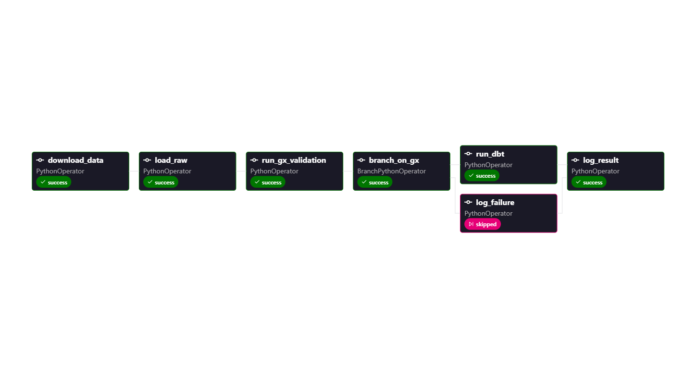

# NYC Yellow Taxi Data Pipeline

A production-grade batch data pipeline built for Analytics Engineering and Data Engineering portfolio. Processes NYC TLC Yellow Taxi trip records through a full modern data stack - ingestion, data quality validation, transformation, orchestration, and a live dashboard.

**Live Dashboard -> [nyc-taxi-data.streamlit.app](https://nyc-taxi-data.streamlit.app/)**

## Stack

| Layer | Tool |
|-||
| Ingestion | Python, pandas, pyarrow |
| Warehouse | Snowflake |
| Data Quality | Great Expectations 1.x |
| Transformation | dbt |
| Orchestration | Apache Airflow (via Astro CLI) |
| Dashboard | Streamlit + Plotly |


## Dataset

NYC TLC Yellow Taxi Trip Records - Nov 2025, Dec 2025, Jan 2026

- 12,211,339 rows across three months
- Zone lookup table - 265 rows
- Source: NYC Taxi and Limousine Commission

## Architecture
```
NYC TLC (Parquet files)
        │
        ▼
  Airflow DAG
  (orchestrates full pipeline monthly)
        │
        ▼
  Python Ingestion
        │
        ▼
  Snowflake RAW layer
  RAW_TRIPS | RAW_ZONE_LOOKUP
        │
        ▼
  Great Expectations
  (16 expectations, 500k row sample)
        │
     pass / fail
        │
   pass ──────────────────────────────────────────────┐
        │                                             │
        ▼                                             ▼
   dbt build                                   log failure
   (staging -> intermediate -> marts)            (Snowflake log)
        │
        ▼
  Snowflake MARTS layer
  mart_daily_revenue
  mart_pickup_zones
  mart_payment_summary
  mart_trip_duration
        │
        ▼
  Streamlit Dashboard
  (live on Streamlit Cloud)

```

## Project Structure

```
nyc-taxi-data-pipeline/
├── data/
│   └── raw/                                  # gitignored - raw data in parquet files
├── exploration/
│   └── explore.py                            # data download and data exploration scripts
├── ingestion/
│   └── load.py                               # ingestion to Snowflake
├── expectations/
│   └── taxi_raw_suite.py                     # Great Expectations validation suite
├── utils/
│   └── snowflake_utils.py                    # function created for Snowflake connection
├── dbt_project/
│   └── nyc_taxi_data_pipeline/
│       ├── models/
│       │   ├── staging/                      # stg_trips, stg_zone_lookup
│       │   ├── intermediate/                 # int_trips_joined
│       │   └── marts/                        # four mart models
│       ├── tests/
│       │   └── assert_pickup_before_dropoff.sql
│       ├── macros/
│       │   └── generate_schema_name.sql
│       └── models/exposures.yml
├── dags/
│   └── taxi_pipeline_dag.py                  # Airflow DAG
├── streamlit_app/
│   ├── app.py                                # Streamlit dashboard
│   └── requirements.txt
├── assets/
│   └── airflow_dag.png                       # DAG run screenshot
├── Dockerfile                                # Astro CLI Docker config file
├── requirements.txt
└── README.md
```


## Pipeline Details

### Ingestion

`ingestion/load.py` loads monthly parquet files into Snowflake using pyarrow row group chunking - reads one row group at a time rather than loading the entire file into memory. Idempotent - checks if a month is already loaded before inserting, so running the script twice produces the same result.

### Data Quality

Great Expectations 1.x suite with 16 expectations across the raw trips table:

- Not null checks on 10 columns
- Timestamp ordering (pickup before dropoff) - mostly=0.97
- Fare amount range - mostly=0.88
- Trip distance range - mostly=0.95
- RatecodeID accepted values
- Row count between 2M and 6M per month
- Column existence checks

Runs on a 500k row TABLESAMPLE of RAW_TRIPS for performance.

### dbt Transformation

Three-layer dbt project:

**Staging** - views, thin cleanup layer. Casts types, renames columns, adds `pickup_date` and `trip_duration_minutes` derived columns.

**Intermediate** - view, joins trips to zone lookup on both pickup and dropoff location IDs. Adds borough and zone names to every trip row.

**Marts** - four models, two incremental and two full table refresh:

46 dbt tests passing across all layers including not null, unique, accepted values, referential integrity, and a custom singular test asserting pickup before dropoff.

### Orchestration

Monthly Airflow DAG (`0 0 1 * *`) orchestrated via Astro CLI. Runs at 12am on 1st of every month.

### Dashboard

Four charts on a single Streamlit page:

- Daily revenue trend by borough - line chart with borough filter
- Top pickup zones by hour of day - heatmap (top 20 zones, filterable by borough)
- Payment type breakdown - trip volume and tip rate side by side
- Average vs median trip duration by borough - grouped bar showing outlier skew

## Airflow DAG Run

All tasks green end to end:




## Running Locally

### Prerequisites

- Python 3.13
- Snowflake account
- Docker Desktop
- Astro CLI

### Setup

Clone the repo:

```powershell
git clone https://github.com/DataChaser/data_engineering_portfolio.git
cd data_engineering_portfolio\nyc-taxi-data-pipeline
```

Create `.env` file in project root and copy contents from `.env.sample` into it

Install dependencies:

```powershell
pip install -r requirements.txt
```

### Ingestion

```powershell
python -m ingestion.load
```

### Data Quality

```powershell
python -m expectations.taxi_raw_suite
```

### dbt

```powershell
cd dbt_project\nyc_taxi_data_pipeline
dbt build --full-refresh
```

### Airflow

```powershell
astro dev start
```

Open `http://localhost:8080`, toggle on `taxi_data_pipeline`, trigger manually.

### Streamlit

```powershell
cd streamlit_app
pip install -r requirements.txt
streamlit run app.py
```

## Key Design Decisions

**Chunked ingestion** - pyarrow row group reading keeps memory usage constant regardless of file size. Handles 4M+ row monthly files on a machine with limited RAM.

**Incremental marts where appropriate** - only applied where a date dimension exists and new data adds new rows. All-time aggregations stay as full table refresh to avoid incorrect results.

**GX quality gate** - dbt only runs if validation passes. Failures are logged to Snowflake. Prevents bad data from propagating into the mart layer.

**Idempotent ingestion** - running the pipeline multiple times for the same month produces the same result. Safe to rerun without manual cleanup.